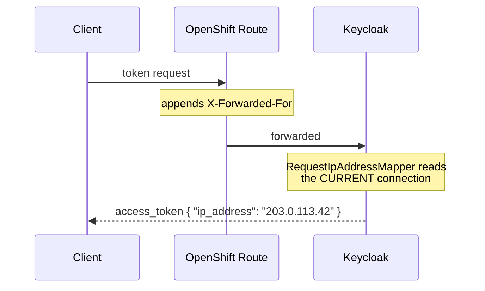

# keycloak-request-ip-mapper

[](https://github.com/JoWe112/kc-oidc-request-ip-mapper/actions/workflows/ci.yml)
[](LICENSE)
[](https://openjdk.org/projects/jdk/21/)
[](https://www.keycloak.org/)

A Keycloak OIDC protocol mapper that adds **the IP address of the HTTP request that issued
the token** as a claim.

## Why

Keycloak records the client IP on the user session at login time. Several stock approaches
(session notes, scripts) surface that value — but it is frozen at login. On a
`refresh_token` grant, which involves no browser and may arrive from a completely different
network hours later, that address is stale and misleading.

This mapper reads the address from the *in-flight* HTTP request instead
(`KeycloakSession → KeycloakContext → ClientConnection#getRemoteAddr()`), so it is correct
for every grant type.



| | Login-time IP | This mapper |
|---|---|---|
| `authorization_code` grant | correct | correct |
| `refresh_token` grant | **stale** — the login IP | the refreshing caller's IP |
| Source | `UserSessionModel#getIpAddress()` | `KeycloakContext#getConnection()` |

### Protocol support

**OIDC only.** `AbstractOIDCProtocolMapper#getProtocol()` returns `openid-connect` and
Keycloak filters the mapper list by protocol, so this mapper never appears on — nor runs
for — a SAML client.

A SAML equivalent would be a separate class extending `AbstractSAMLProtocolMapper` and
implementing `SAMLAttributeStatementMapper`, using `AttributeStatementHelper` for its config
and one extra `provided` dependency (`keycloak-saml-core-public`). It is lower value: SAML
has no refresh-token grant, so for a normal browser SSO assertion the request IP and the
login IP are the same address anyway.

## Requirements

- Java 21
- Maven 3.9+
- Keycloak **26.7.x** (Quarkus distribution). The provider is compiled against the exact
  server version — see `keycloak.version` in [pom.xml](pom.xml).

## Build

```bash
mvn -B verify
```

Produces `target/keycloak-request-ip-mapper-0.1.0.jar`. All Keycloak artifacts are
`provided` scope, so the JAR contains only the mapper class and its service registration:

```bash
unzip -p target/keycloak-request-ip-mapper-0.1.0.jar \
  META-INF/services/org.keycloak.protocol.ProtocolMapper
# com.example.keycloak.mapper.RequestIpAddressMapper
```

## Build and push the image

The [Containerfile](Containerfile) builds the JAR, drops it into
`/opt/keycloak/providers/`, and runs `kc.sh build` so the runtime can use
`start --optimized`. Add your own build-time options at the marked placeholder before
building.

```bash
podman build -f Containerfile -t registry.example.com/keycloak/keycloak-request-ip:26.7.4 .
```

Scan before pushing — the registry rejects HIGH/CRITICAL findings:

```bash
podman run --rm -v "$HOME/.cache/trivy:/root/.cache/trivy" -v "$PWD/.trivyignore:/.trivyignore:ro" aquasec/trivy:0.74.0 image --ignorefile /.trivyignore --severity HIGH,CRITICAL --exit-code 1 registry.example.com/keycloak/keycloak-request-ip:26.7.4
```

```bash
podman push registry.example.com/keycloak/keycloak-request-ip:26.7.4
```

[.trivyignore](.trivyignore) records the findings currently accepted in the base image, each
with a justification and an expiry date. Entries expire rather than persist, so they come
back for review instead of silently accumulating — re-read the file whenever you bump
`keycloak.version`.

> The image tag should track the Keycloak version the provider was built against. Bump
> `keycloak.version` in `pom.xml`, the base image in `Containerfile`, and the tag together.

## Deploy

Full manifest: [deploy/keycloak-deployment.yaml](deploy/keycloak-deployment.yaml)
(Deployment + Service + Route, plain YAML — no Operator, no Helm).

The part that matters for this mapper is the proxy configuration. Behind an OpenShift Route,
`getRemoteAddr()` returns the **router pod's** IP unless Keycloak is told to trust the
forwarded headers:

```yaml
        env:
          - name: KC_PROXY_HEADERS
            value: "xforwarded"
          - name: KC_PROXY_TRUSTED_ADDRESSES
            value: "10.128.0.0/14"   # <<< REPLACE: router/ingress pod CIDR
```

Both are runtime options — no rebuild needed to change them.

The HAProxy router appends `X-Forwarded-For` by default
(`ROUTER_SET_FORWARDED_HEADERS=append`), so a stock Route needs no annotation. Only if your
cluster's `IngressController` default was changed to `never`/`if-none` do you need
`haproxy.router.openshift.io/set-forwarded-headers: "append"` on the Route.

> **Security:** trusting `X-Forwarded-For` is only sound while Keycloak is reachable
> exclusively via the Route. Keep the trusted CIDR narrow and treat the claim as audit
> telemetry, not as an authorization input. See [docs/openshift.md](docs/openshift.md).

## Add the mapper in the admin console

1. **Clients** → select your client
2. **Client scopes** tab → `<client-id>-dedicated`
3. **Add mapper** → **By configuration**
4. Pick **Request IP Address**
5. Fill in:

   | Field | Value |
   |---|---|
   | Name | `request ip` |
   | Token Claim Name | `ip_address` |
   | Add to access token | **On** |
   | Add to ID token | optional |
   | Add to userinfo | optional |
   | Add to token introspection | optional |

6. **Save**

If "Request IP Address" is not in the list, the JAR was not picked up — check the pod logs
for provider registration and confirm `kc.sh build` ran after the JAR was copied in.

## Verify

Decode an access token payload:

```bash
decode() { cut -d. -f2 <<<"$1" | tr '_-' '/+' | base64 -d 2>/dev/null | jq .; }
```

### 1. `authorization_code` grant

Complete a browser login, exchange the code, then:

```bash
decode "$ACCESS_TOKEN"
```

```json
{
  "iss": "https://keycloak.apps.example.com/realms/demo",
  "ip_address": "203.0.113.42",
  "...": "..."
}
```

`ip_address` must equal the public IP you browsed from (`curl -s ifconfig.me`).

### 2. `refresh_token` grant — the important one

Run this **from a different host or network** than the one you logged in from:

```bash
curl -s -X POST "https://keycloak.apps.example.com/realms/demo/protocol/openid-connect/token" -d grant_type=refresh_token -d client_id=demo-client -d client_secret="$CLIENT_SECRET" -d refresh_token="$REFRESH_TOKEN" | jq -r .access_token
```

Decode it. `ip_address` must now show the **second** host's IP, not the IP you originally
logged in from. That difference is the whole point of the mapper — a login-time-IP
implementation would still report the first address here.

## Project layout

```
pom.xml                  provider build; Keycloak deps are `provided`
Containerfile            multi-stage: build JAR → install → kc.sh build
deploy/                  plain Deployment + Service + Route
docs/openshift.md        proxy headers, trusted addresses, troubleshooting
src/main/java/...        RequestIpAddressMapper
src/main/resources/META-INF/services/org.keycloak.protocol.ProtocolMapper
src/test/java/...        RequestIpAddressMapperTest
```

## Notes on the SPI

`org.keycloak.protocol.ProtocolMapper` — the interface the provider is registered under —
lives in **`keycloak-server-spi-private`**, so it carries no cross-version stability
guarantee. There is no public alternative for protocol mappers. Everything else the mapper
touches (`KeycloakSession`, `KeycloakContext`, `ClientConnection`,
`OIDCAttributeMapperHelper`) is public SPI. Re-verify on every Keycloak minor upgrade.

## License

[Apache-2.0](LICENSE)
