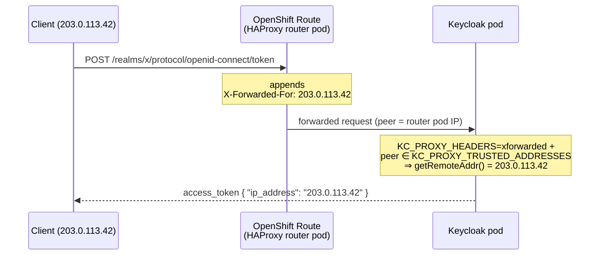

# Running behind an OpenShift Route

The mapper reads `session.getContext().getConnection().getRemoteAddr()`. That value is the
address Keycloak believes the request came from — which, behind a reverse proxy, is only the
real client IP if Keycloak has been told to trust the proxy's forwarded headers.

## The request path



## Required runtime configuration

| Variable | Value | Why |
|---|---|---|
| `KC_PROXY_HEADERS` | `xforwarded` | Tells Keycloak to read `X-Forwarded-For` / `-Proto` / `-Host`. Without it the headers are ignored entirely and the claim carries the router pod's IP. |
| `KC_PROXY_TRUSTED_ADDRESSES` | the router/ingress pod CIDR | Keycloak 26 only honours forwarded headers when the immediate peer is in this list. |

Both are **runtime** options, so they can be set as env vars on a `start --optimized`
container — they do not require another `kc.sh build`.

Find the cluster pod network CIDR:

```bash
oc get network.config/cluster -o jsonpath='{.status.clusterNetwork[*].cidr}'
```

For a tighter list, use the router pods' actual addresses:

```bash
oc -n openshift-ingress get pods -l ingresscontroller.operator.openshift.io/deployment-ingresscontroller=default -o jsonpath='{.items[*].status.podIP}'
```

### Why this changed in Keycloak 26

Keycloak ≤ 23 used `KC_PROXY=edge`, which trusted forwarded headers from *any* peer. That
option is gone. Keycloak 26 splits the decision in two: which headers to read
(`KC_PROXY_HEADERS`) and whom to believe (`KC_PROXY_TRUSTED_ADDRESSES`). Setting only the
first has no effect.

## Security note

Trusting `X-Forwarded-For` is only safe while Keycloak is reachable **exclusively** through
the Route. If a pod inside the cluster can reach the Service directly and its IP falls inside
`KC_PROXY_TRUSTED_ADDRESSES`, it can put any address it likes into the `ip_address` claim.

Mitigations:

- Keep `KC_PROXY_TRUSTED_ADDRESSES` as narrow as possible — ideally the router pod IPs, not
  the whole cluster network.
- Add a `NetworkPolicy` restricting ingress to the Keycloak Service to the
  `openshift-ingress` namespace.
- Treat the claim as **telemetry, not an authorization input**. It is useful for audit
  trails and anomaly detection; it is not a second factor.

## The Route

The default HAProxy router already appends `X-Forwarded-For`
(`ROUTER_SET_FORWARDED_HEADERS=append`), so a stock Route needs no annotation.

Only if the cluster's `IngressController` default was changed to `never` or `if-none` do you
need to override it per-Route:

```yaml
metadata:
  annotations:
    haproxy.router.openshift.io/set-forwarded-headers: "append"
```

Check the cluster default with:

```bash
oc -n openshift-ingress-operator get ingresscontroller/default -o jsonpath='{.spec.httpHeaders}'
```

## Troubleshooting

| Symptom | Cause |
|---|---|
| Claim shows `10.x.x.x` / `172.x.x.x` | `KC_PROXY_HEADERS` unset, or the router IP is not in `KC_PROXY_TRUSTED_ADDRESSES`. |
| Claim absent entirely | Mapper not added to the client's dedicated scope, or "Add to access token" is off, or the token was minted without an HTTP request in scope. |
| Claim shows the wrong client on refresh | Something is caching tokens in front of Keycloak; the mapper itself always re-reads the current request. |
